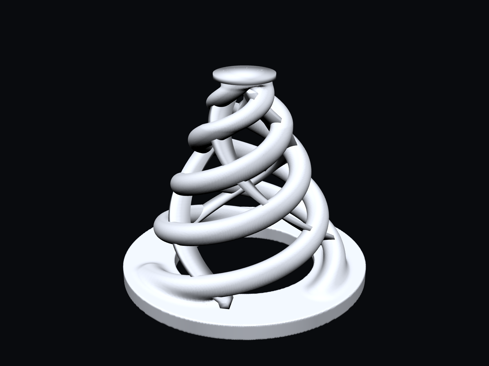

# TriFlex

**Triple-Helix Mesh Trigger Cone**

**TriFlex — A 3D-printable triple-helix piezo trigger cone for electronic mesh drum pads.**

TriFlex is a mechanical trigger-cone project for electronic drums using mesh heads and piezo sensors. Instead of a conventional solid foam cone, it uses three TPU helical spring arms and stabilizing membranes to tune compliance, lateral stability, sensitivity, and hotspot behavior.

## Mechanical concept

The helix arms provide vertical compliance. The membranes add lateral stability and tune the spring response without turning the geometry into a closed shell.

The piezo is approximately 27-28 mm in diameter. A small centered adhesive pad supports its metal side against the drum plate, and TriFlex contacts the ceramic side. The piezo is therefore supported near its center from below and loaded through an annular/peripheral region from above. The center-open underside is intentional: it permits piezo flexure and is believed to contribute strongly to sensitivity. This is a mechanical hypothesis consistent with observed behavior; it has not yet been instrumented. See [docs/DESIGN.md](docs/DESIGN.md).

## Project status

**Current stable physical baseline: V29**

- TPU body height: 32 mm
- Base: Ø38 mm
- Top contact: Ø9 mm
- Three helix arms: Ø3.3 mm
- Membrane: 1.30 mm
- Membrane roots connected to base
- Center-open underside
- 3 mm allowance for a compliant top interface

V29 has been physically printed and tested and produced excellent sensitivity with a substantial reduction in hotspot compared with the earlier V26 configuration.

**Current experiment: V30**

V30 preserves the V29 target geometry and reduces only the helix-arm target diameter from Ø3.3 mm to Ø3.1 mm. It has been physically printed and completed an initial successful test in a 12-inch PD-128 BC with an original two-ply mesh head and a TD-9 module. Excellent sensitivity and ghost-note response, substantially reduced hotspot, and good print quality were observed. V30 remains experimental pending repeatability and durability work; V29 remains the stable control.

[View the complete V30 physical photo log](docs/V30-PHOTO-LOG.md).

## Model files

| File | Status |
|---|---|
| [`models/stable/triflex-v29.stl`](models/stable/triflex-v29.stl) | Stable — physically printed and tested |
| [`models/experimental/triflex-v30-experimental.stl`](models/experimental/triflex-v30-experimental.stl) | Physically tested experimental candidate — repeatability and durability pending |

The STL files contain the 32 mm TPU body only. The 3 mm top allowance is reserved for a separate felt/foam/compliant contact and is not modeled in the STL.

Mesh check (both files): watertight, consistent winding, bounding box 38 × 38 × 32 mm, top contact Ø9.0 mm.

**V29 is preserved byte-for-byte as the canonical stable artifact** (SHA-256 `6ba6824379025cc35e50dc8483c4deec778fa85bb63e8777b1d8f94238a3a9a2`). It contains 5 closed shells/components that are not boolean-unioned. This is intentional: this exact STL was sliced in Cura and physically validated. "Non-unioned" is not permission to repair, union, remesh, or normalize the stable file. A unioned or cleaned-up variant must be a new experimental revision and must be physically retested before it can be called stable.

## Printing and material summary

- Material: RhinoLab TPU 95A HS
- Printer: Creality Ender-3 S1, Sprite direct drive, 0.4 mm nozzle
- Slicer: Cura 5.2.1
- Layer height 0.20 mm · nozzle 220°C (first layer 225°C) · bed 35°C (first layer 40°C)
- Print speed 28 mm/s · outer wall 22 mm/s · retraction 0.5 mm at 15 mm/s · fan 20-35% after first layer
- Build plate adhesion: none — the validated V29 print used no brim
- Dry TPU before critical prints; the reference spool was dried at 70°C for approximately 8 hours.

Reference Cura profile: [`cura/TriFlex_Ender3S1_TPU95A_V29_Validated.curaprofile`](cura/TriFlex_Ender3S1_TPU95A_V29_Validated.curaprofile), extracted from the validated V29 G-code. [docs/PRINTING.md](docs/PRINTING.md) is the authoritative printing reference.

## Documentation

- [Development history — prototype evolution through V30](docs/DEVELOPMENT-HISTORY.md)
- [V30 physical photo log](docs/V30-PHOTO-LOG.md)
- [Design and geometry](docs/DESIGN.md)
- [Printing guide](docs/PRINTING.md)
- [Physical testing log](docs/TESTING.md)
- [Engineering instructions](AGENTS.md)
- [Changelog](CHANGELOG.md)

## Development discipline

TriFlex revisions should normally change one mechanical variable at a time. Generated geometry and engineering hypotheses must be distinguished from physically tested results. V29 remains unchanged as the stable reference while experimental revisions are evaluated.

## License

TriFlex is **source-available for personal and non-commercial use**. Commercial use is not granted by the repository license.

Read [LICENSE.md](LICENSE.md) before downloading, modifying, printing, or redistributing the project. Commercial manufacture, sale, inclusion in paid kits/products, or other commercial exploitation requires a separate written license; see [COMMERCIAL-LICENSE.md](COMMERCIAL-LICENSE.md).

This project is not described as OSI open source because commercial use is restricted.

## Independence / trademarks

TriFlex is an independent project. Any third-party manufacturer or product names used in technical compatibility notes are descriptive only and do not imply affiliation, sponsorship, or endorsement.

## Development state

The repository is under active engineering development. Durability, print-to-print repeatability, and extended strike testing are planned before a public production release.
