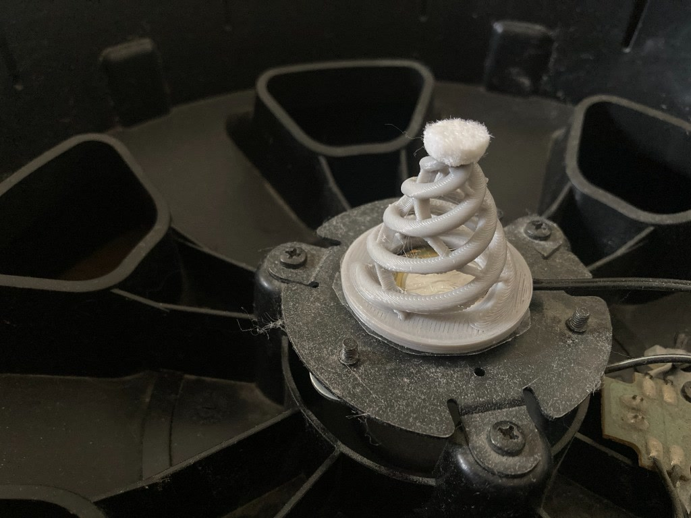

# TriFlex Development Report — Prototype Evolution to V30

This document records the engineering path that led to the current TriFlex triple-helix mesh trigger cone. It preserves successful dimensions, failed approaches, physical observations, corrections, and the development discipline used to reach the current design.

Sections describing work before V26 are retrospective development notes. Where no dated artifact or formal test record exists in the repository, they should not be interpreted as instrumented laboratory data.

## 1. Development objective

The project began with a practical target: replace the conventional foam cone used between a mesh drum head and a piezo sensor with a 3D-printable TPU structure that is sensitive enough for ghost notes, mechanically stable under the mesh head, compliant vertically, resistant to excessive lateral wobble, capable of allowing the piezo to flex rather than simply compressing it, reproducible with FDM printing, and less prone to a strong center hotspot.

The reference envelope evolved around a roughly Ø38 mm base and an installed height of approximately 35 mm.

The current sensor architecture uses an approximately Ø27–28 mm piezo. A small centered adhesive pad supports the metal side of the piezo against the drum plate. TriFlex contacts the ceramic side. The underside remains center-open so the piezo can flex under annular/peripheral loading.

Prototypes using this center-open load path have shown very high sensitivity in physical testing. The load path is therefore intentionally preserved, but its causal contribution and exact strain distribution have not yet been instrumented; the explanation remains an engineering hypothesis rather than a measured result.

## 2. Development strategy

The project gradually moved from exploratory geometry toward controlled A/B development.

Current rules:

1. Preserve a physically successful revision as a reference artifact.
2. Change one mechanical variable at a time whenever practical.
3. Separate physical observations from mechanical hypotheses.
4. Do not call an STL stable merely because it is watertight or slices successfully.
5. Do not repair, remesh, smooth, or boolean-union a validated STL merely for CAD cleanliness.
6. Keep the center-open piezo load path unless a dedicated experiment is intended to test it.
7. Treat the compliant top interface as part of the mechanical system.
8. Validate generated files for dimensions, mesh integrity and slicing before printing.
9. A new revision becomes stable only after completing the required physical test scope; an initial successful test alone does not make it stable.

This discipline was adopted after early prototypes changed too many geometric variables at once, making it difficult to identify the cause of improvements.

## 3. Prototype evolution

### Solid cone — rejected

The first basic direction was a solid TPU cone.

**Physical result:** too stiff.

The solid structure did not provide the spring behavior required for a responsive mesh-head trigger.

**Lesson:** compliance had to come from geometry rather than Shore hardness alone.

### Bellows concepts — promising compliance, poor print behavior

Several bellows-style cones were developed. The bellows geometry provided substantially more vertical movement than the solid cone and demonstrated that a structured TPU spring could work.

Problems included stringing, weak or separated bellows roots, local tearing, difficult support removal, and excessive stiffness in later reinforced variants.

A bellows + membrane hybrid was one of the better intermediate concepts and confirmed that thin membranes could stabilize an otherwise compliant structure.

**Lesson:** the structure needed a cleaner load path and fewer print-sensitive folds.

### Double-helix concepts — too soft / unstable

A double-helix spring was explored. It provided excellent freedom of movement but became too soft and laterally unstable for the intended mesh-head application.

Attempts included smoother top/bottom transitions, fillets, channels and membrane-assisted variants.

**Lesson:** helix springs were promising, but two arms did not provide enough lateral control.

### Lattice / trellis / matrix concepts — rejected for manufacturability

Internal lattice and mesh-like structures introduced substantial manufacturing problems: difficult slicing, inaccessible support material, poor support removal in TPU, and unnecessary internal complexity.

**Lesson:** an open, printable spring structure was preferable to an internal lattice.

### Triple helix — architecture selected

The design converged on three independent helical spring arms spaced approximately 120° apart. The third arm improved lateral stability while retaining vertical compliance.

The architecture became three rounded TPU helix arms, open spaces between the arms, a small flat top contact, a wide circular base, and later thin membranes associated with the helix arms.

This triple-helix architecture became the foundation of TriFlex.

## 4. Membrane development

The bare triple helix was still too soft and could wobble laterally.

Thin membranes were added along the inner/back side of the helix arms. Their purpose was not to turn the cone into a closed shell, but to stabilize the spring system and tune its response.

Design principle:

> Helix arms primarily provide vertical compliance; membranes primarily provide lateral stability and additional spring tuning.

Membrane geometry therefore became a separate design variable from helix diameter.

## 5. V26 — first major physical success

V26 was the first prototype that demonstrated the core architecture could outperform the earlier concepts.

### Geometry

- Body height: 35 mm
- Base: Ø38 mm
- Top contact: Ø9 mm
- Helix arms: 3
- Helix diameter: Ø3.3 mm
- Membrane: 1.50 mm
- Underside: center-open

### Physical testing

V26 was tested in both 8-inch and 12-inch mesh pads.

Observed:
- excellent sensitivity,
- very good low-level triggering,
- strong overall response,
- but a pronounced hotspot directly above the cone.

The subjective assessment was that the basic cone behavior was exceptionally good apart from the hotspot.

### Engineering interpretation

The same architecture that produces strong sensitivity probably also concentrates the direct center strike. The center-supported piezo and peripheral/annular loading allow strong piezo bending.

The project deliberately did not respond by immediately filling the center or drastically reducing electronic sensitivity, because either change could sacrifice ghost-note performance.

V26 established the triple-helix + membrane + center-open architecture as the direction to continue.

## 6. Mesh and geometry correction attempts

Several intermediate STL operations were attempted while trying to improve membrane surfaces and installed height.

A visible stair-step/ladder appearance existed on the membranes in Cura while the helix arms appeared comparatively smooth.

Findings:
- the defect was already present in the source geometry,
- generic mesh smoothing was not an appropriate correction,
- the STL was watertight, so searching only for open boundary chains did not address the problem,
- global smoothing risked changing helix diameter and membrane thickness,
- and a file should not be labelled "smooth" unless the geometry has actually changed and been visually/mesh validated.

A global Z-scaling approach during the V27 stage also demonstrated why uncontrolled transforms are undesirable: they can preserve unwanted membrane artifacts while changing mechanical dimensions elsewhere.

**Lesson:** future cleanup should reconstruct the intended smooth helical membrane parametrically rather than applying generic mesh smoothing to the complete validated part.

## 7. Installed height and compliant top interface

The project separated the TPU spring body from the final mesh-contact layer.

A 3 mm self-adhesive furniture felt was available and proved mechanically attractive as the top interface.

The target became:
- TPU body: 32 mm
- compliant top interface: approximately 3 mm
- installed system height: approximately 35 mm

The felt is cut to approximately Ø9–10 mm to match the contact region.

It is treated as a functional mechanical layer because it can soften the initial mesh-to-TPU impact, provide a short compliant transition, distribute the first stage of contact, reduce hard direct contact, and potentially contribute to hotspot control.

The felt should be held constant during geometry A/B tests.

Alternative progressive TPU tips with multiple small rounded contact points were considered, but felt and printed-tip concepts should be tested separately rather than stacked together.

## 8. V28 — 32 mm body / tip allowance stage

V28 established the 32 mm TPU-body target with 3 mm reserved for the compliant top interface.

The lower geometry was largely preserved while the upper region was compressed to achieve the new height.

A structural issue was then noticed: the membrane roots did not clearly join the base plate.

This was important because membrane-to-base attachment affects lateral stability and is therefore a genuine mechanical variable, not merely a cosmetic mesh correction.

## 9. V29 — physically validated stable reference

V29 incorporated the next major mechanical refinement.

### Geometry

- Body height: 32 mm
- Base: Ø38 mm
- Top: Ø9 mm
- Three helix arms
- Helix diameter: Ø3.3 mm
- Membrane: 1.30 mm
- Membrane roots connected to base
- Center-open underside
- 3 mm compliant-top allowance

Compared with V26, several variables had changed: body height 35 → 32 mm, membrane 1.50 → 1.30 mm, membrane roots connected to the base, and a separate 3 mm top-interface allowance was introduced.

For that reason, the subsequent hotspot improvement cannot scientifically be attributed to membrane thinning alone.

### Physical result

V29 produced excellent overall sensitivity, very good response, substantially reduced hotspot, and the best overall performance observed in the project up to that test.

This made V29 the **current physically validated stable baseline**.

### Stable-artifact rule

The canonical V29 STL contains five closed, non-unioned shells/components.

Because that exact STL was successfully sliced, printed and physically tested, it is intentionally preserved as-is.

It must not be silently boolean-unioned, remeshed, normalized or "repaired." A cleaned or unioned version would be a new experimental derivative and would require physical retesting.

> Reproducibility of a physically validated artifact takes priority over cosmetic CAD cleanliness.

## 10. V30 — physically tested experimental candidate

V30 is the latest design revision.

The goal is to make the spring slightly softer without sacrificing the lateral stability obtained from the 1.30 mm membranes.

V30 preserves the V29 target geometry except for one intended mechanical variable:
- V29 helix: Ø3.3 mm
- V30 helix: Ø3.1 mm

The membrane remains 1.30 mm.

For a simplified bending member, stiffness has a strong diameter dependence. A simple comparison gives (3.1 / 3.3)^4 ≈ 0.78, suggesting roughly 22% lower arm bending stiffness in an idealized beam comparison.

TriFlex is not a simple straight beam, so this is not a prediction of 22% lower complete-cone stiffness. It is only a design-direction estimate.

V30 has been physically printed and completed an initial successful functional test.

### Initial physical test

Setup:
- 12-inch PD-128 BC pad,
- original two-ply Roland mesh head,
- Roland TD-9 module,
- self-adhesive furniture-felt top interface.

Subjective observations:
- excellent sensitivity,
- excellent ghost-note response,
- substantially reduced hotspot,
- good print quality.

Module trigger settings and test duration were not recorded. Controlled V29/V30 A/B comparison, print-to-print repeatability, and extended durability also remain outstanding. V30 is therefore a **physically tested experimental candidate**, not the stable baseline.

Additional physical installations in a KD-85 kick pad and a custom DIY pad are documented photographically without separate performance claims. See the [complete V30 physical photo log](V30-PHOTO-LOG.md).

A combined [V30 test video](https://www.youtube.com/watch?v=LNGkQPw1kC0) demonstrates the PD-128 BC, DIY pad, and KD-85 in sequence. The same performance is presented first through Steven Slate Drums 5 via TD-9 MIDI and then with the raw physical pad sound.

## 11. Material development

The current reference material is RhinoLab TPU 95A HS.

Published properties used during development include approximately:
- Shore hardness: 95A
- density: ~1.22 g/cm³
- tensile strength: ~27.3 MPa
- elongation: >650%
- recommended drying: approximately 70°C / 8 h

The material has already demonstrated excellent physical trigger behavior in the validated prototype, so it is the project benchmark rather than merely a temporary filament.

Future TPU comparisons should use the same STL and same test conditions. Geometry and material should not be changed simultaneously.

## 12. Moisture and stringing correction

TPU moisture became a major manufacturing variable.

Earlier prints showed heavy stringing and occasional weak features. After drying the RhinoLab TPU at approximately 70°C for around 8 hours, stringing tower performance became nearly clean.

Stringing returned after the spool spent time exposed to ambient air. This observation is consistent with filament conditioning materially affecting print quality, but ambient moisture uptake was not instrumented.

Current manufacturing practice:
- dry TPU before critical prints,
- print directly from the dryer when practical,
- keep the spool enclosed,
- do not infer room humidity from the dryer's internal RH reading,
- use a separate room hygrometer when environmental tracking is required.

This changed the project approach: some apparent geometry failures can actually be process/material-conditioning failures.

## 13. Printing process corrections

Reference machine:
- Creality Ender-3 S1
- Sprite direct drive
- 0.4 mm nozzle
- Cura 5.2.1

The physically validated V29 G-code established the authoritative slicing reference.

A repository audit found that the Cura profile contained a stored brim width of 6 mm, but the actual validated V29 G-code used adhesion type "none". Therefore the validated V29 print used **no brim**.

The 6 mm brim is documented only as an optional troubleshooting aid, not as the reference process.

The reference profile is named:

TriFlex_Ender3S1_TPU95A_V29_Validated.curaprofile

It was extracted from the validated G-code so the repository profile represents the actual successful print rather than relying on an older hand-maintained profile.

## 14. Support strategy

Dense support proved undesirable with TPU because it was difficult to remove and could damage delicate geometry.

The design direction therefore favors support-minimized geometry.

If support becomes necessary, the conservative starting strategy is sparse tree support, build-plate-only, with generous TPU separation and a light interface. Dense Grid support is avoided.

## 15. Sensor architecture lessons

Sensor-side decisions intentionally preserved:
- piezo approximately Ø27–28 mm,
- small centered adhesive support on the metal side,
- TriFlex contacting the ceramic side,
- center-open cone underside,
- no central post,
- outer piezo area allowed to flex.

Filling the center may reduce hotspot but could also reduce sensitivity and ghost-note response. It should not be introduced casually into the stable design.

A flexible neck directly below the top contact was also rejected because excessive local compliance there could interfere with mesh-head behavior.

## 16. What the project has learned

- A solid TPU reproduction of a foam cone is too stiff.
- Geometric compliance is more important than nominal Shore hardness alone.
- Bellows can provide compliance but are print-sensitive.
- Two helix arms are too laterally unstable.
- Three helix arms provide a better stability/compliance balance.
- Membranes are effective for controlling lateral motion.
- Membrane thickness and helix diameter should be treated as separate tuning variables.
- The center-open piezo load path appears to be a major contributor to sensitivity.
- Hotspot reduction must not be pursued at the expense of ghost-note sensitivity.
- A compliant felt contact layer is promising and should be standardized during testing.
- TPU moisture control materially affects print quality.
- Validated G-code is more authoritative than stale slicer-profile labels.
- A mechanically validated STL should not be cosmetically "fixed" without creating a new experimental revision.
- One-variable A/B testing is now the preferred development method.

## 17. Current state

### Stable physical baseline — V29

H32 / base Ø38 / top Ø9 / helix Ø3.3 / membrane 1.30 / membrane roots connected / center-open / 3 mm compliant-top allowance.

V29 remains the preserved stable control.

### Physically tested experimental candidate — V30

Same target system as V29, with helix diameter reduced from Ø3.3 to Ø3.1 mm.

V30 has been physically printed and completed an initial successful functional test. It must not be described as stable or production-ready until controlled comparison, repeatability, and durability work is recorded.

## 18. Next development step

The next controlled test should keep all practical variables fixed and compare V29 against V30.

Record at minimum:
- material and drying state,
- slicer/profile,
- felt thickness and diameter,
- pad size,
- drum module/settings,
- low-level/ghost-note response,
- center hotspot,
- edge-to-center response,
- lateral stability,
- rebound/feel,
- visible deformation,
- print defects.

V30 can be considered for promotion only if controlled comparison and repeated prints support the initial positive result without materially worsening hotspot, lateral stability, or triggering consistency. Until then, V29 remains the stable reference and V30 remains experimental.

Longer-term validation should include multiple prints and cyclic strike testing (initial milestones: 10,000 and 20,000 hits), followed by inspection for helix fatigue, membrane-root cracking, permanent set, height loss and response drift.

---

## 19. Update — V30 promoted to stable (2026-10-05)

Multiple V30 prints behaved consistently and passed strike testing of up to approximately 10,000 hits, as reported by the maintainer. V30 was promoted to the stable baseline and its STL moved, unmodified, to `models/stable/triflex-v30.stl`. The controlled V29/V30 A/B comparison described in section 18 was not recorded before promotion. V29 remains preserved as the previous stable control. Sections 17 and 18 above describe the state before this promotion.

---

**Revision note:** This report documents the development path through V30. It deliberately distinguishes measured/observed results from engineering hypotheses, preserves V29 as the stable control, and records V30 as a physically tested experimental candidate with repeatability and durability work still pending.
