# V30 Physical Photo Log

These photographs document the physically printed V30 prototype, installation examples, the compliant felt interface, and comparison with conventional foam cones.

V30 is physically printed and has completed an initial successful functional test. The photographs are evidence of physical construction and installation; they do not by themselves establish durability or production readiness.

Third-party manufacturer and product names are used descriptively only. TriFlex is independent and is not affiliated with, sponsored by, or endorsed by those manufacturers.

## PD-128 BC installation

V30 installed in a PD-128 BC pad with the compliant felt interface.

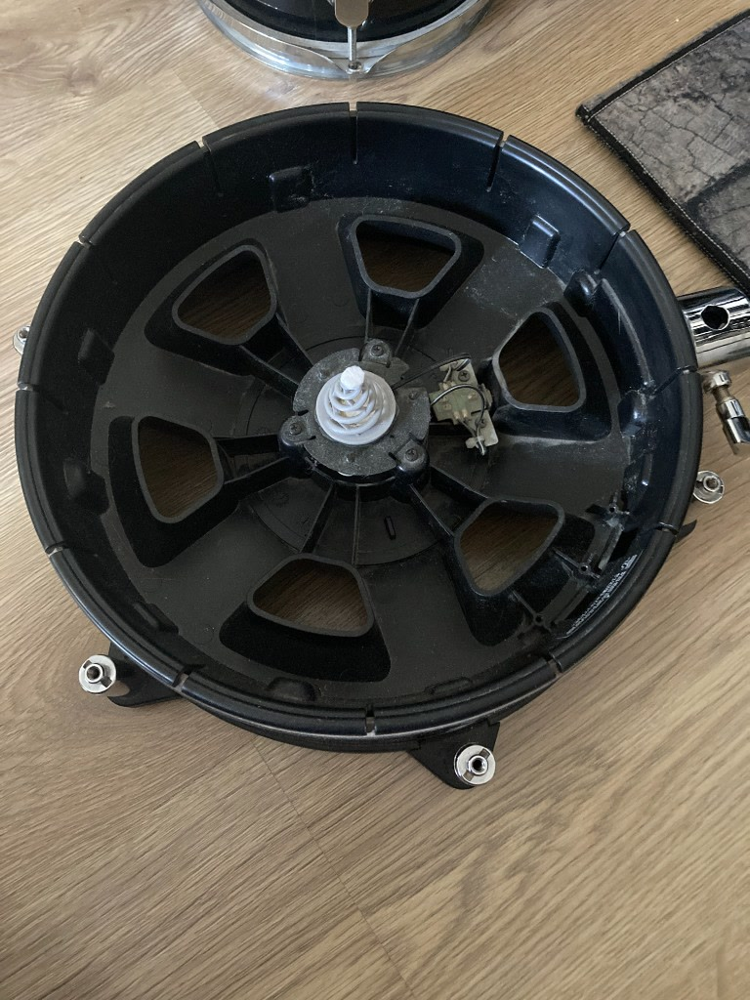

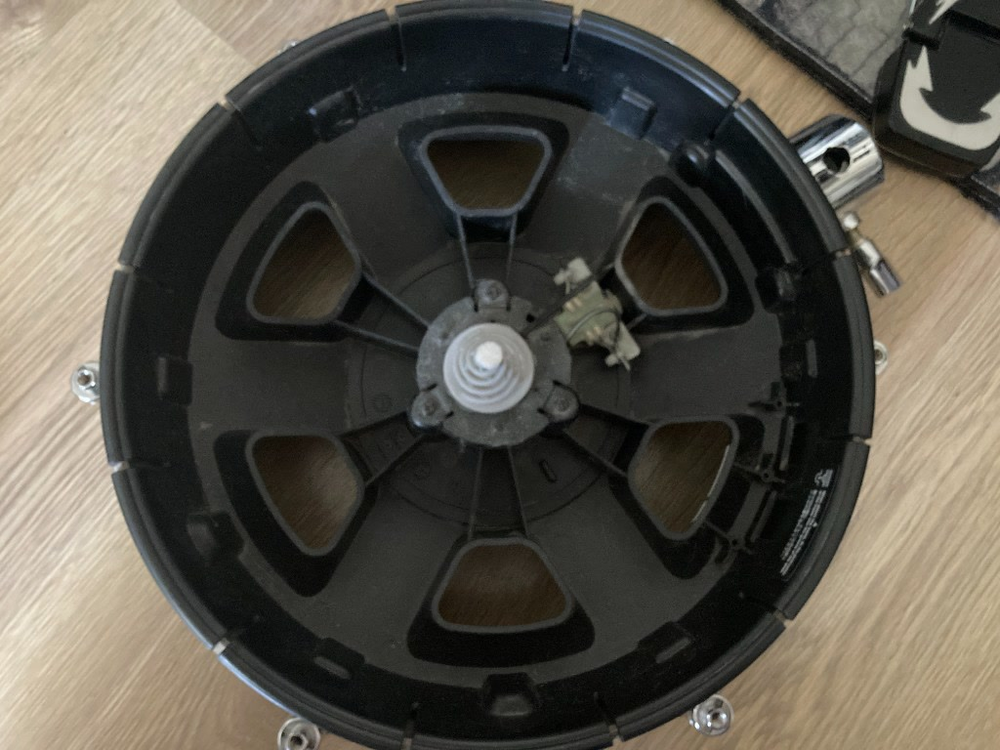

## KD-85 installation

KD-85 kick-pad assembly and the installed V30 prototype.

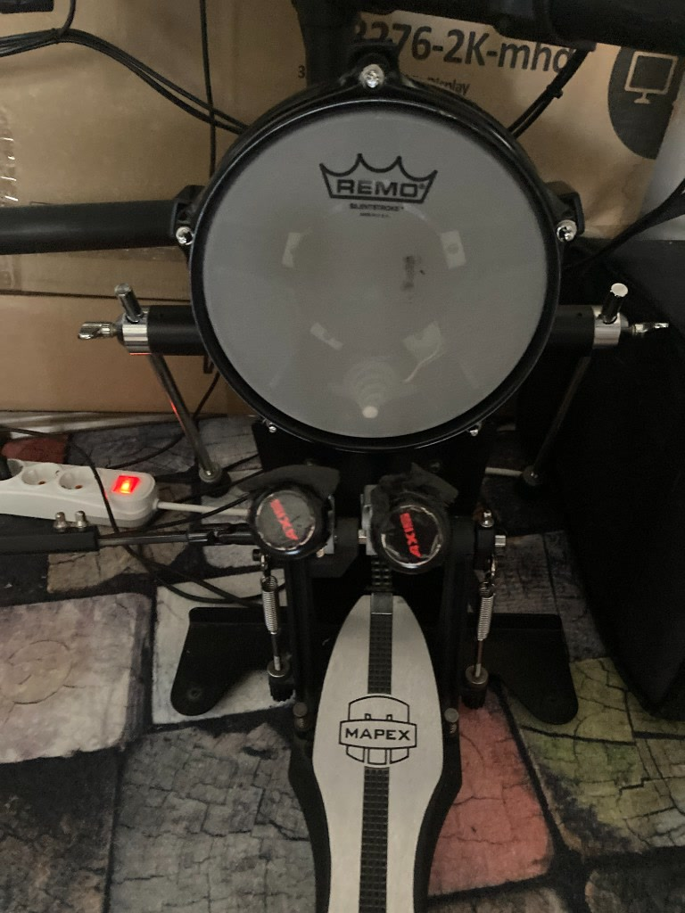

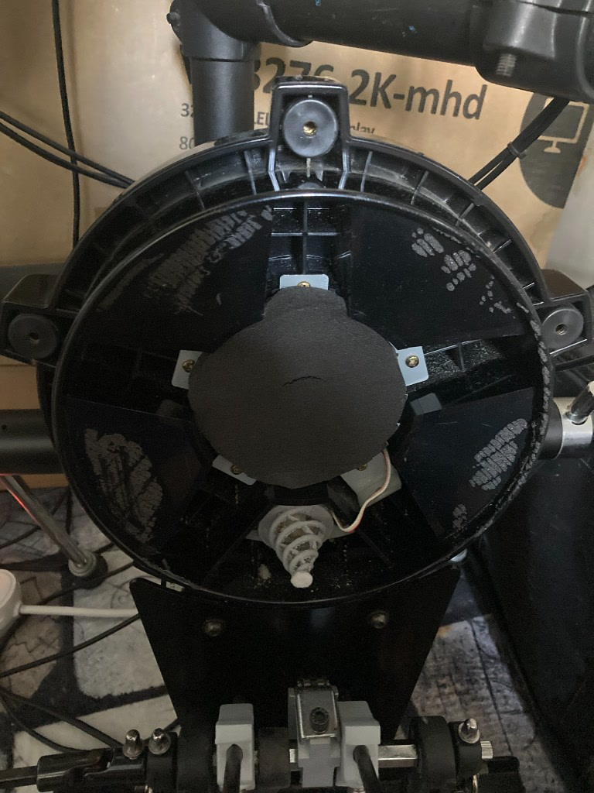

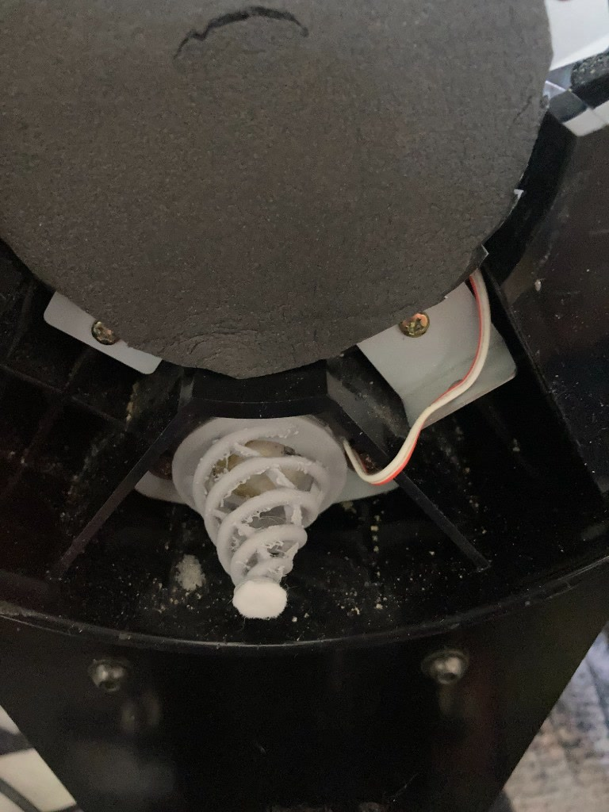

## DIY pad installation

V30 installed in a custom DIY pad assembly.

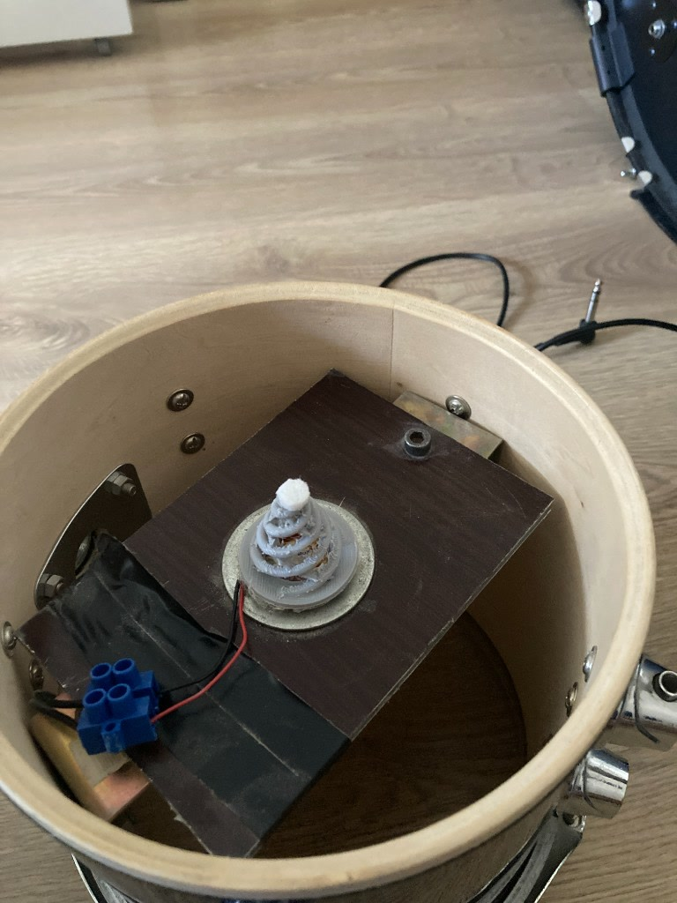

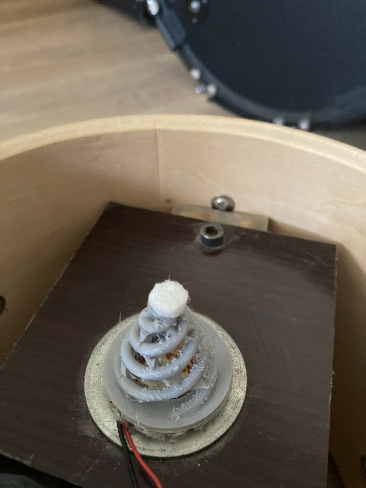

## Compliant felt interface

Self-adhesive furniture felt discs used as the compliant top interface. These are ordinary furniture-protection pads that can be sourced from furniture or household-goods stores.

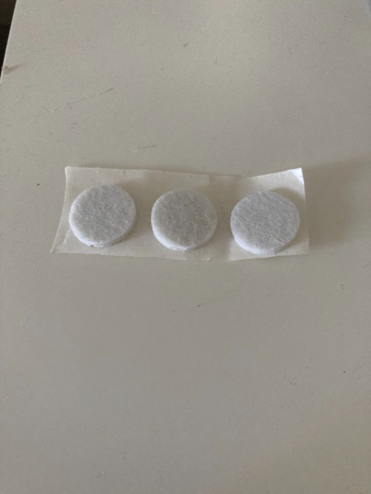

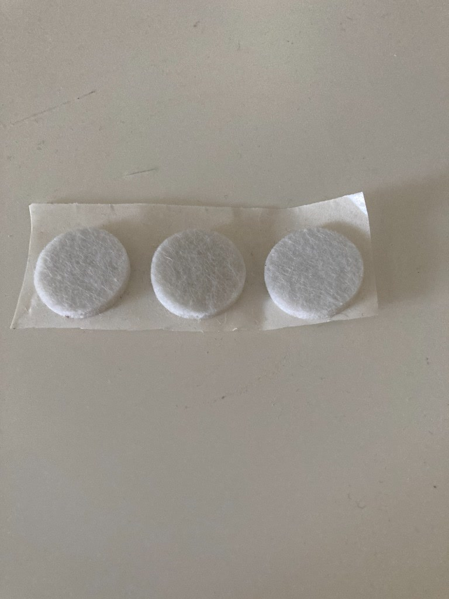

## Conventional cone comparison

The damaged original cone removed from the PD-128 BC and a visual comparison between a used/damaged original cone and an unused original cone.

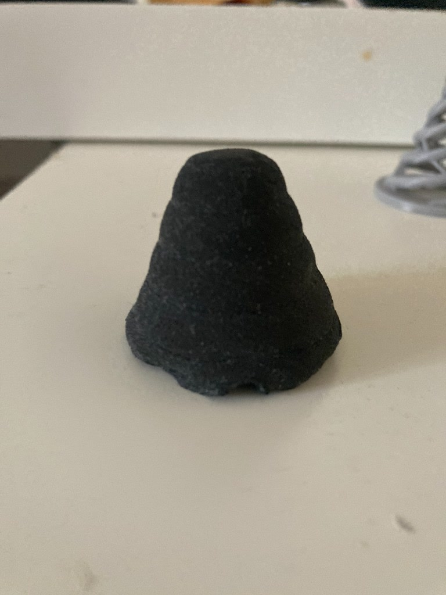

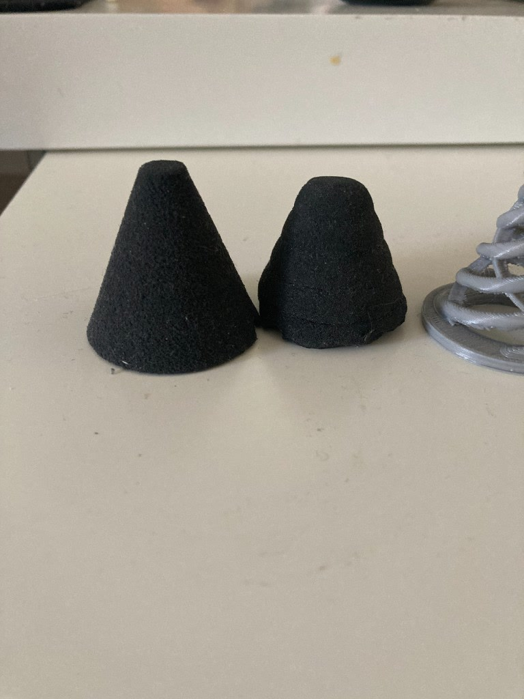

## Physical test video

[Watch the V30 test on PD-128 BC, DIY pad, and KD-85 — SSD5 + raw acoustic audio](https://www.youtube.com/watch?v=LNGkQPw1kC0).

The first half uses Steven Slate Drums 5 triggered through TD-9 MIDI. The second half repeats the same performance with the raw physical pad sound recorded by the camera microphone.

## Publication note

The published JPEG files were re-encoded without source EXIF metadata. The original photographs are retained locally outside version control.
